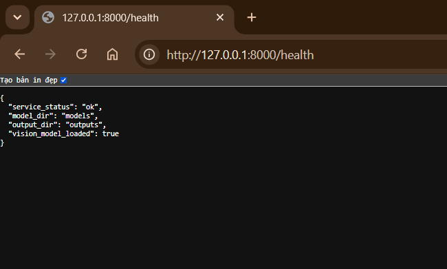
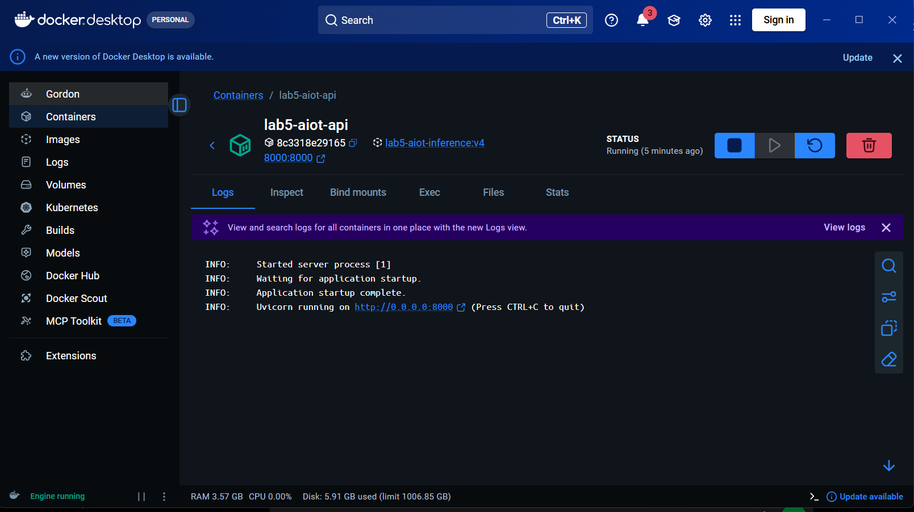
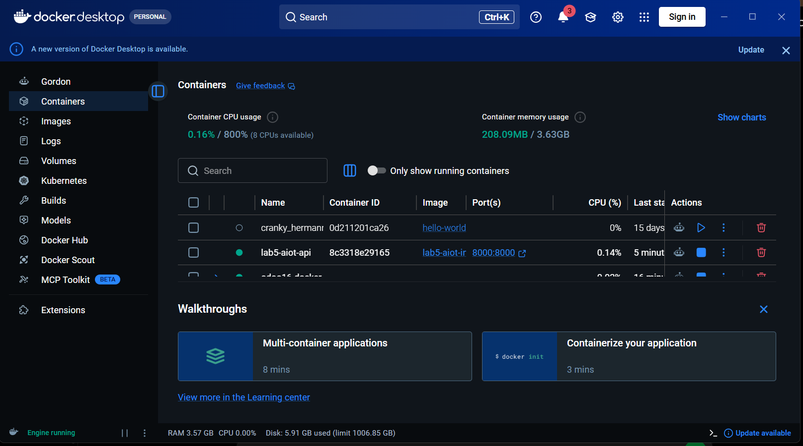
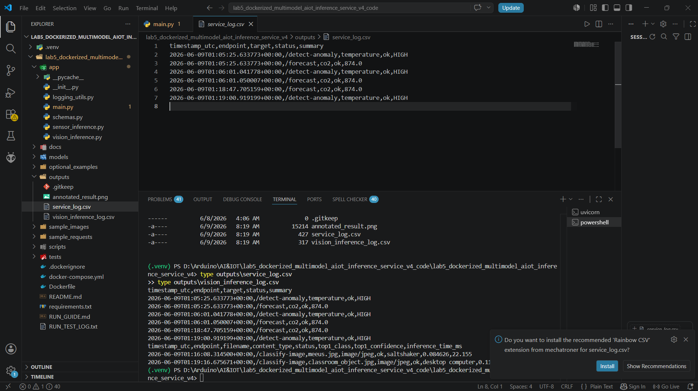
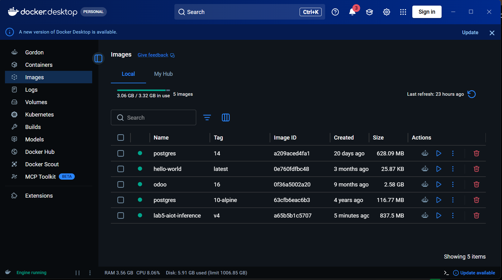
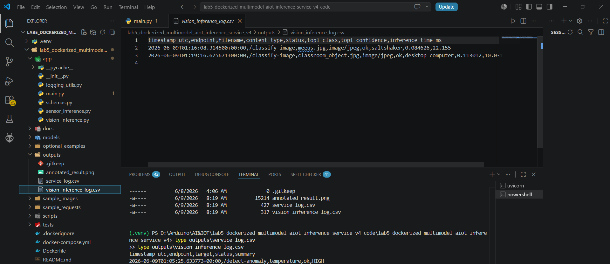

# Lab 5 V4 - Dockerized Multi-Model AI Inference Service for AIoT

## 1. Giới thiệu

Lab 5 V4 xây dựng một AI inference service cho hệ thống AIoT. Project sử dụng FastAPI để cung cấp các API xử lý dữ liệu telemetry JSON và ảnh upload. Service sau đó được đóng gói bằng Docker để có thể chạy ổn định trên môi trường khác.

Mục tiêu chính của Lab 5 không phải là train lại model, mà là triển khai model đã có thành một service có API, log, health check, Docker image và Docker container.

## 2. Mục tiêu bài lab

Sau khi hoàn thành bài lab, hệ thống có thể:

* Chạy AI inference service bằng FastAPI.
* Kiểm tra trạng thái service bằng endpoint `/health`.
* Test các endpoint telemetry như `/detect-anomaly`, `/forecast`, `/predict-risk`.
* Upload ảnh qua giao diện web `/classify-image-demo`.
* Phân loại ảnh bằng model SqueezeNet ONNX ImageNet-1K.
* Trả về top-k class, confidence và inference time.
* Ghi log kết quả inference vào thư mục `outputs/`.
* Build Docker image `lab5-aiot-inference:v4`.
* Chạy service bằng Docker container và Docker Compose.

## 3. Liên hệ với Lab 3 và Lab 4

Lab 3 tập trung vào phát hiện bất thường với output như `anomaly_score`, `severity`, `decision`.

Lab 4 tập trung vào dự báo giá trị tương lai với output như `predicted_value`, `risk_level`, `recommendation`.

Lab 5 áp dụng vào giai đoạn triển khai của Lab 3 và Lab 4. Cụ thể:

* Model anomaly của Lab 3 có thể được triển khai thành endpoint `/detect-anomaly`.
* Model forecasting của Lab 4 có thể được triển khai thành endpoint `/forecast`.
* Docker giúp đóng gói runtime, thư viện, model, API, port, volume và log để service chạy ổn định hơn.

Docker không làm model chính xác hơn, nhưng giúp model dễ triển khai, dễ chia sẻ và dễ kiểm thử hơn.

## 4. Công nghệ sử dụng

* Python
* FastAPI
* Uvicorn
* ONNX Runtime
* Pillow
* NumPy
* Docker
* Docker Compose
* SqueezeNet ONNX ImageNet-1K

## 5. Cấu trúc project

```text
app/                 Mã nguồn FastAPI service
docs/                Tài liệu hướng dẫn và giải thích
models/vision/       Model ONNX và file label ImageNet
optional_examples/   Ví dụ chuyển đổi PyTorch/TensorFlow sang ONNX/TFLite
outputs/             File log sinh ra khi inference
sample_images/       Ảnh mẫu để test upload
sample_requests/     Request JSON mẫu để test API
scripts/             Script tải model và smoke test
tests/               Test API local
Dockerfile           Công thức build Docker image
docker-compose.yml   Cấu hình chạy service bằng Docker Compose
requirements.txt     Danh sách thư viện Python
README.md            Tài liệu mô tả project
RUN_GUIDE.md         Hướng dẫn chạy nhanh
RUN_TEST_LOG.txt     Log test mẫu
```

## 6. Các endpoint chính

| Endpoint                    | Phương thức | Ý nghĩa                                |
| --------------------------- | ----------- | -------------------------------------- |
| `/health`                   | GET         | Kiểm tra service còn hoạt động không   |
| `/model-info`               | GET         | Xem thông tin service và model         |
| `/detect-anomaly`           | POST        | Phát hiện bất thường telemetry         |
| `/forecast`                 | POST        | Dự báo giá trị telemetry               |
| `/predict-risk`             | POST        | Chuyển giá trị dự báo thành mức rủi ro |
| `/vision/model-info`        | GET         | Xem thông tin model ảnh                |
| `/classify-image`           | POST        | Upload ảnh và trả JSON top-k class     |
| `/classify-image-annotated` | POST        | Trả ảnh PNG có gắn nhãn dự đoán        |
| `/classify-image-demo`      | GET         | Giao diện web upload ảnh               |

## 7. Chạy local

### Bước 1: Tạo môi trường ảo

```powershell
python -m venv .venv
Set-ExecutionPolicy -Scope Process -ExecutionPolicy RemoteSigned
.\.venv\Scripts\Activate.ps1
```

### Bước 2: Cài thư viện

```powershell
pip install -r requirements.txt
```

### Bước 3: Tải model ảnh

```powershell
python scripts/download_vision_model.py
```

Sau khi tải xong, thư mục `models/vision/` cần có:

```text
squeezenet1.1-7.onnx
imagenet_classes.txt
```

### Bước 4: Smoke test local

```powershell
python scripts/smoke_test_local.py
```

Kết quả mong đợi:

```text
GET /health 200 PASS
GET /model-info 200 PASS
POST /detect-anomaly 200 PASS
POST /forecast 200 PASS
GET /vision/model-info 200 PASS
GET /classify-image-demo 200 PASS
LOCAL_PIPELINE_TEST_PASS
```

### Bước 5: Chạy FastAPI

```powershell
uvicorn app.main:app --reload
```

Mở trình duyệt:

```text
http://127.0.0.1:8000/health
http://127.0.0.1:8000/docs
http://127.0.0.1:8000/classify-image-demo
```

## 8. Test API bằng curl

### Test forecast

```powershell
curl.exe -X POST "http://127.0.0.1:8000/forecast" `
  -H "Content-Type: application/json" `
  -d "@sample_requests/forecast_request.json"
```

### Test anomaly

```powershell
curl.exe -X POST "http://127.0.0.1:8000/detect-anomaly" `
  -H "Content-Type: application/json" `
  -d "@sample_requests/detect_anomaly_request.json"
```

### Test classify image

```powershell
curl.exe -X POST "http://127.0.0.1:8000/classify-image?top_k=5" `
  -F "file=@sample_images/classroom_object.jpg;type=image/jpeg"
```

### Tạo ảnh annotated

```powershell
curl.exe -X POST "http://127.0.0.1:8000/classify-image-annotated?top_k=5" `
  -F "file=@sample_images/classroom_object.jpg;type=image/jpeg" `
  --output outputs/annotated_result.png
```

## 9. Kết quả log

Sau khi test API, thư mục `outputs/` sinh ra các file:

```text
service_log.csv
vision_inference_log.csv
annotated_result.png
```

Ví dụ kết quả local:

```text
/detect-anomaly -> HIGH
/forecast -> 874.0
/classify-image -> desktop computer, confidence 0.113012
```

## 10. Build Docker image

```powershell
docker build -t lab5-aiot-inference:v4 .
```

Kiểm tra image:

```powershell
docker images
```

Cần thấy image:

```text
lab5-aiot-inference   v4
```

## 11. Chạy Docker container

```powershell
docker run --rm --name lab5-aiot-api -p 8000:8000 `
  -v ${PWD}/outputs:/app/outputs `
  -v ${PWD}/models/vision:/app/models/vision `
  lab5-aiot-inference:v4
```

Mở trình duyệt:

```text
http://127.0.0.1:8000/health
http://127.0.0.1:8000/docs
http://127.0.0.1:8000/classify-image-demo
```

## 12. Chạy bằng Docker Compose

```powershell
docker compose up --build
```

Kiểm tra service:

```powershell
docker compose ps
```

Xem logs:

```powershell
docker compose logs -f
```

Dừng service:

```powershell
docker compose down
```

## 13. Minh chứng chạy chương trình

### Health local


### Swagger Docs local



### Upload ảnh local


### Docker Images



### Docker Container Running



### Docker Logs



### Upload ảnh trong Docker



### Docker Compose



## 14. So sánh chạy local và chạy Docker

| Tiêu chí               | Chạy local                                 | Chạy Docker                              |
| ---------------------- | ------------------------------------------ | ---------------------------------------- |
| Môi trường             | Dùng Python `.venv` trên máy cá nhân       | Dùng Docker image đã đóng gói            |
| Cài thư viện           | Cài bằng `pip install -r requirements.txt` | Cài trong quá trình `docker build`       |
| Chạy service           | `uvicorn app.main:app --reload`            | Container tự chạy Uvicorn                |
| Truy cập API           | `http://127.0.0.1:8000`                    | `http://127.0.0.1:8000` qua port mapping |
| Đường dẫn model        | `models/vision/` trên máy local            | `/app/models/vision` trong container     |
| Ghi log                | Ghi trực tiếp vào `outputs/`               | Ghi qua volume `outputs:/app/outputs`    |
| Debug                  | Dễ sửa code và chạy lại                    | Cần đọc Docker logs                      |
| Chia sẻ cho máy khác   | Dễ lỗi khác version Python/package         | Dễ chạy lại hơn nếu image đúng           |
| Gần triển khai thực tế | Thấp hơn                                   | Cao hơn                                  |

## 15. Nhận xét

Lab 5 cho thấy một model AI sau khi train cần được đóng gói thành service để có thể triển khai thực tế. FastAPI giúp định nghĩa endpoint rõ ràng, Docker giúp chuẩn hóa môi trường chạy, còn logs giúp quan sát quá trình inference.

Model ảnh trong bài là SqueezeNet ImageNet-1K, đây là model tổng quát nên kết quả phân loại có thể chưa chính xác với mọi ảnh chuyên ngành. Khi confidence thấp, không nên dùng kết quả để ra quyết định tự động mà cần xem thêm top-k class và bối cảnh sử dụng.

## 16. Kết luận

Bài Lab 5 đã hoàn thành việc xây dựng một Dockerized Multi-Model AI Inference Service cho AIoT. Service chạy được local, xử lý telemetry JSON, upload ảnh, ghi log, build Docker image, chạy container và Docker Compose. Đây là bước triển khai tiếp theo sau Lab 3 và Lab 4, giúp đưa model AI từ môi trường thử nghiệm sang service có thể chạy lại trên môi trường khác.
